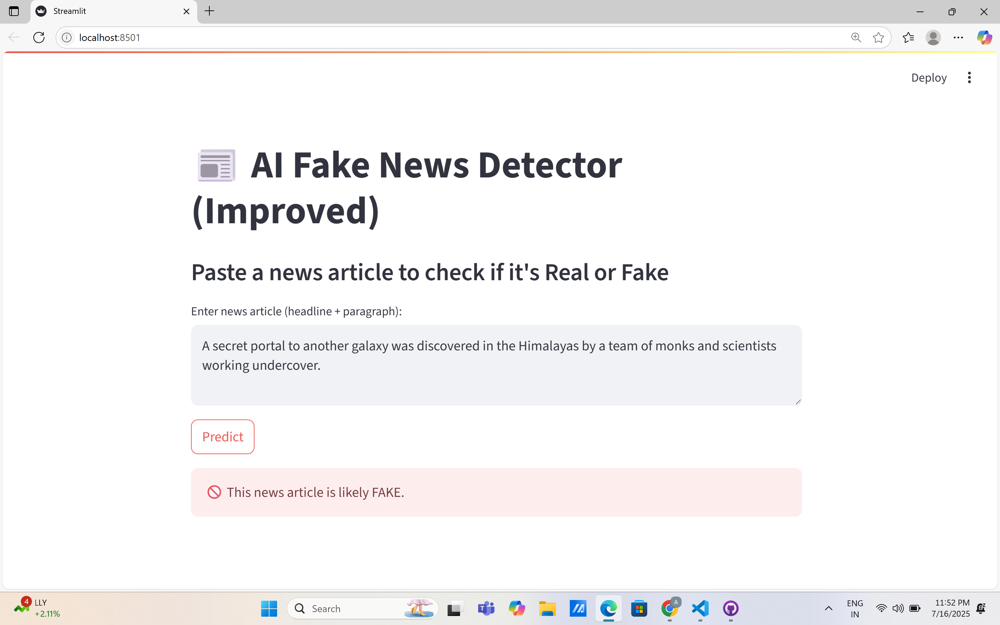

# 📰 Fake News Detector AI App

A machine learning web app that detects whether a news article is **real** or **fake** using NLP techniques. Built using Python, Scikit-learn, and Streamlit.

 

---

## 🚀 Features

- Classifies news as Real ✅ or Fake ❌
- Cleaned text using NLTK (stopwords, punctuation, links)
- Combined article **title + body** for improved accuracy
- Built-in **Streamlit interface** for real-time prediction
- Achieved **~98–99% accuracy** using Logistic Regression

---

## 📁 Project Structure